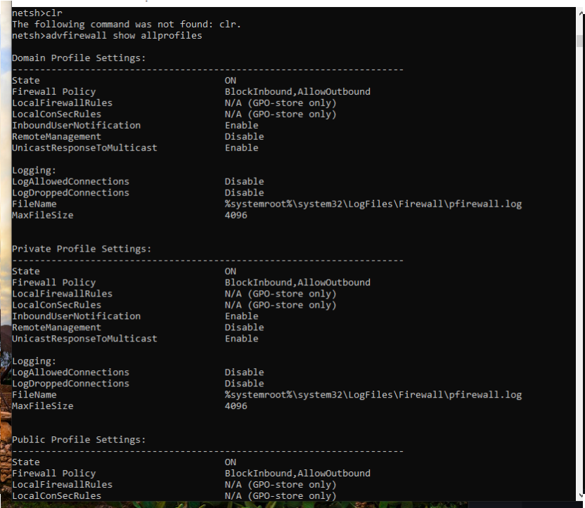

# 🛡️ Cyber Projects & Security Toolkit  

## 📌 Overview  
A hands-on collection of cybersecurity projects, research, and tools focused on network security, penetration testing, and system analysis.  
This repository demonstrates practical experience in identifying vulnerabilities, analyzing network activity, and understanding attacker techniques.  

---

## 🧪 Projects  

### 🔍 Windows Network & Firewall Analysis Lab
- Captured and analyzed active network connections using `netstat -ano`  
- Identified running processes and mapped them to open ports (PID correlation)  
- Reviewed Windows Firewall configurations across profiles  
- Documented potential risks and suspicious activity  

📁 Supporting Files:  
- `/logs/netstat.txt`  
- `/logs/tasklist.txt`  
- `/logs/firewall.txt`  

---

## 📂 Repository Contents  

- **Firewalls/**  
  Configuration, testing, and analysis of network defense mechanisms  

- **Hardware Security Research/**  
  Exploration of tools such as ESP32-S2, Pwnagotchi, and Flipper Zero for security testing  

- **Malware Research/**  
  Analysis of suspicious behavior using Windows CMD and Python-based techniques  

---

## 🧰 Skills & Tools  

- **Networking:** TCP/UDP protocols, port analysis, connection monitoring  
- **Security:** Firewall configuration, Evil Twin attack concepts, threat detection basics  
- **Scripting:** Python for automation and analysis  
- **Systems:** Windows command-line tools (`netstat`, `tasklist`, `netsh`)  

---

## 🚨 Key Takeaways  
- Developed the ability to analyze live network traffic and system activity  
- Improved understanding of how attackers exploit misconfigurations  
- Built foundational skills in defensive security and system monitoring 

---

## :camera: Screenshots 

---

## ⚖️ Disclaimer  
All research and scripts are for **educational and ethical purposes only**. Unauthorized access to systems is illegal.
